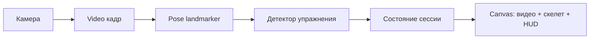

# Workout Counter React

Веб-приложение для подсчёта повторений по веб-камере с помощью MediaPipe Pose.

## Что умеет сейчас

- Рисует видео и скелет позы в одном `canvas` (отдельный элемент `<video>` в интерфейсе не показывается).
- Считает повторения для подъёма на бицепс и приседаний; показывает фазы, confidence и диагностические углы в HUD.
- **Озвучка повторений** на русском через Web Speech API: после каждого засчитанного повтора произносится число (если синтез речи поддерживается браузером).
- **Таймер отдыха** после остановки сессии («Стоп камера»): длительность задаётся выпадающим списком «Отдых» (1, 2, 3 или 5 минут, по умолчанию 3). На `canvas` отображается кольцевой прогресс и оставшееся время; в начале и в конце отдыха — короткие голосовые подсказки.
- **Голосовое управление** (Web Speech API, русский язык): старт, пауза, сброс счётчика, остановка камеры с переходом к отдыху, выбор длительности отдыха голосом, переключение упражнения по имени и синонимам. Статус микрофона и распознавания отображается в строке состояния.

Подробный справочник фраз: [docs/voice-commands.md](docs/voice-commands.md). Требования к браузеру, камере и микрофону: [docs/browser-requirements.md](docs/browser-requirements.md).

Идеи и бэклог развития продукта — в [todo.md](todo.md) (таблица: направления, признак готовности; полный список не дублируется в README).

## Запуск

```bash
npm install
npm run dev
```

Откройте URL из Vite в браузере. Для камеры и (при голосовом управлении) микрофона браузер запросит разрешения. Для `getUserMedia` нужен **HTTPS** или **localhost**.

## Скрипты

- `npm run dev` — локальная разработка (Vite).
- `npm run build` — проверка TypeScript и production-сборка.
- `npm run preview` — локальный просмотр уже собранного приложения (после `npm run build`).
- `npm run lint` — ESLint.
- `npm run test` — unit-тесты детекторов (Vitest).

Перед PR имеет смысл выполнить `npm run lint` и `npm run test`.

## Планирование фич

Для **каждой значимой фичи** (не для мелких правок) заводите в репозитории пару артефактов:

1. **План** — контекст, цели, этапы и критерии готовности (markdown).
2. **Задачи реализации** — чеклист конкретных шагов со ссылкой на план.

Кладите их в каталог `features/<краткое-имя-фичи>/` (латиница, дефисы). Имена файлов и структура — по аналогии с примером для документации: [features/documentation/documentation-update-plan.md](features/documentation/documentation-update-plan.md) и [features/documentation/documentation-implementation-tasks.md](features/documentation/documentation-implementation-tasks.md).

## Стек

React 19, TypeScript, Vite 8, MediaPipe Tasks Vision (`pose_landmarker_lite`), Vitest.

## Архитектура

- `src/camera` — запуск и остановка потока с камеры.
- `src/pose` — MediaPipe Pose landmarker, нормализация и сглаживание landmarks.
- `src/exercises` — детекторы упражнений (`ExerciseDetector`), реестр `registry.ts`, типы.
- `src/render` — отрисовка кадра на canvas: видео, скелет, HUD; отдельно — экран отдыха (`drawRestCountdown`).
- `src/app/useWorkoutSession.ts` — **ядро сессии**: связывает камеру, landmarker, выбранный детектор и рендер; управляет циклом `requestAnimationFrame`, паузой, сбросом, остановкой с таймером отдыха и озвучкой повторений.

### Поток данных



Кратко: кадр с камеры → оценка позы → обновление детектора и счётчика повторов → отрисовка на canvas.

## Голосовое управление (кратко)

Распознавание непрерывное; между одинаковыми командами действует короткая задержка (антидребезг). Команды смены упражнения строятся из `name` и поля `voiceAliases` каждого детектора (см. `src/exercises/types.ts`).

Полный перечень фраз и пояснения по статусам — в [docs/voice-commands.md](docs/voice-commands.md).

## Таймер отдыха

- **UI:** поле «Отдых» задаёт длительность в минутах для следующего отдыха.
- **Поведение:** по нажатию «Стоп камера» сессия останавливается, камера отключается, на пустом canvas показывается обратный отсчёт с кольцом прогресса.
- **Голос:** можно сказать, например, «отдых три минуты» — длительность применится при следующей остановке камеры (см. таблицу в [docs/voice-commands.md](docs/voice-commands.md)).

## Как добавить новое упражнение

1. Создайте файл `src/exercises/<имя>.ts`.
2. Реализуйте интерфейс `ExerciseDetector` из `src/exercises/types.ts`:
   - `id`, `name`, `description`;
   - по желанию `voiceAliases` — фразы для голосового переключения на это упражнение;
   - `createState()` и `update(landmarks, state)` с возвратом фазы, confidence, метрик и `repDelta`.
3. Зарегистрируйте детектор в `src/exercises/registry.ts`.
4. Добавьте или расширьте тесты в `src/exercises/__tests__/detectors.test.ts` (или отдельном файле рядом), чтобы зафиксировать пороги и сценарии счёта.
5. Новое упражнение появится в выпадающем списке.

Пороговые углы и видимость ключевых точек задаются в коде конкретного детектора.

## Примечания

- Загружается модель `pose_landmarker_lite` через `@mediapipe/tasks-vision`.
- Значимые изменения в поведении UI или в наборе голосовых команд желательно сопровождать обновлением README и при необходимости [docs/voice-commands.md](docs/voice-commands.md).
