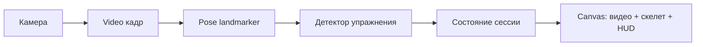

# Workout Counter React

Веб-приложение для подсчёта повторений по веб-камере с помощью MediaPipe Pose.

## Что умеет сейчас

- Рисует видео и скелет позы в одном `canvas` (отдельный элемент `<video>` в интерфейсе не показывается).
- Считает повторения для подъёма на бицепс, приседаний, армейского жима и наклонов головы вправо-влево; показывает фазы, confidence и диагностические углы в HUD.
- **Озвучка повторений** на русском через Web Speech API: после каждого засчитанного повтора произносится число (если синтез речи поддерживается браузером).
- **Таймер отдыха** после остановки сессии (кнопка «Стоп»): длительность задаётся выпадающим списком «Отдых» (1, 2, 3 или 5 минут, по умолчанию 3). На `canvas` отображается кольцевой прогресс и оставшееся время; в начале и в конце отдыха — короткие голосовые подсказки.
- **Голосовое управление** (Web Speech API, русский язык): старт (после паузы возобновляет текущую сессию), пауза, сброс счётчика, завершение сессии голосом (`стоп`, `стоп упражнение`, `закончи упражнение`) с переходом к отдыху, выбор длительности отдыха голосом, переключение упражнения по имени и синонимам. Статус микрофона и распознавания отображается в строке состояния.

Подробный справочник фраз: [docs/voice-commands.md](docs/voice-commands.md). Требования к браузеру, камере и микрофону: [docs/browser-requirements.md](docs/browser-requirements.md). Архитектурная документация: [docs/architecture.md](docs/architecture.md). Конституция проекта: [CONSTITUTION.md](CONSTITUTION.md).

Идеи и бэклог развития продукта — в [todo.md](todo.md) (таблица: направления, признак готовности; полный список не дублируется в README).

## Функции приложения (UI и сценарии)

- **Выбор упражнения:** выпадающий список заполняется автоматически из активных детекторов (`isActive !== false`), а в ходе активной сессии блокируется.
- **Управление сессией:** одна кнопка переключается между `Старт` и `Пауза`: первый запуск и возобновление после паузы — это `Старт`, во время активного выполнения та же кнопка становится `Пауза`. `Сброс` и `Стоп` доступны только во время активного выполнения (пока на основной кнопке отображается «Пауза»); в простое, на паузе и на таймере отдыха они неактивны. `Сброс` обнуляет счётчик и фазу.
- **Пауза и продолжение:** при паузе обработка кадров останавливается, в сцене показывается состояние «Упражнение приостановлено», затем снова `Старт` на той же кнопке продолжает ту же сессию.
- **Остановка сессии:** кнопка `Стоп` завершает сессию, отключает камеру и запускает таймер отдыха на выбранное время.
- **Строка состояния:** показывает готовность модели, состояние камеры, статус голосового распознавания, паузу и ошибки камеры.

## Запуск

```bash
npm install
npm run dev
```

Откройте URL из Vite в браузере. Для камеры и (при голосовом управлении) микрофона браузер запросит разрешения. Для `getUserMedia` нужен **HTTPS** или **localhost**.

## Скрипты

- `npm run dev` — локальная разработка (Vite).
- `npm run build` — проверка TypeScript и production-сборка.
- `npm run preview` — локальный просмотр уже собранного приложения (после `npm run build`).
- `npm run lint` — ESLint.
- `npm run test` — unit-тесты детекторов (Vitest).

Перед PR имеет смысл выполнить `npm run lint` и `npm run test`.

## Политика зависимостей

- Фиксируйте только **конкретные версии** пакетов в `package.json` (без `^`, `~`, `>=` и других диапазонов).
- Для npm в репозитории включён `save-exact=true` (`.npmrc`), чтобы новые зависимости сразу сохранялись как exact.
- После **любого** изменения зависимостей (`package.json`, `package-lock.json`) выполняйте только «чистую» переустановку:

```bash
rm -rf node_modules package-lock.json
npm install
```

Установка поверх существующих `node_modules` после изменения пакетов не считается надёжной и не используется в проекте.

## Планирование фич и исправлений

Для **каждой задачи с изменением продукта** сначала заводите в репозитории пару артефактов (план и чеклист), затем делайте реализацию в коде:

1. **План** — контекст, цели, этапы и критерии готовности (markdown).
2. **Задачи реализации** — чеклист конкретных шагов со ссылкой на план.

Используйте отдельные каталоги по типу задачи:

- `features/<краткое-имя>/` — новая функциональность или заметное расширение поведения.
- `fixes/<краткое-имя>/` — исправление, которое не является новой фичей.
- Любой **hotfix/хотфикс** (включая быстрый визуальный hotfix в UI/CSS) считается **исправлением** и оформляется через `fixes/<краткое-имя>/` с тем же циклом из трёх коммитов: план, реализация, архивирование.

Подробности и правила архивации: [features/README.md](features/README.md), [fixes/README.md](fixes/README.md).

**Коммиты по задаче (три штуки):** (1) только план и чеклист в каталоге задачи; (2) реализация (код, тесты, документация по чеклисту), без архивации; (3) только перенос каталога задачи в соответствующий `_archive` и правка относительных путей в её markdown. Не объединяйте эти этапы в одном коммите.

**После реализации** (чеклист закрыт, результат в коде и документации согласован) **перенесите** каталог задачи в архив: `features/_archive/<то же имя>/` для фич или `fixes/_archive/<то же имя>/` для исправлений. В архиве план остаётся для истории; активная работа ведётся только в активных каталогах вне `_archive`.

Пример оформления завершённой фичи: [documentation-update-plan.md (архив)](features/_archive/documentation/documentation-update-plan.md), [documentation-implementation-tasks.md (архив)](features/_archive/documentation/documentation-implementation-tasks.md).

## Стек

React 19, TypeScript, Vite 8, MediaPipe Tasks Vision (`pose_landmarker_lite`), Vitest.

## Архитектура

- `src/hooks/useCameraStream.ts` — запуск и остановка потока с камеры.
- `src/pose` — MediaPipe Pose landmarker, нормализация и сглаживание landmarks.
- `src/exercises` — детекторы упражнений (`ExerciseDetector`), реестр `registry.ts`, типы.
- `src/render` — отрисовка кадра на canvas: видео, скелет, HUD; отдельно — экран отдыха (`drawRestCountdown`).
- `src/types` — общие типы приложения (в том числе единый тип статусов `EntityStatus`).
- `src/hooks/useWorkoutSession.ts` — **ядро сессии**: связывает камеру, landmarker, выбранный детектор и рендер; управляет циклом `requestAnimationFrame`, паузой, сбросом, остановкой с таймером отдыха и озвучкой повторений.

## Соглашение по импортам

- Между папками `src/*` используйте импорт **только из папки**, а не из конкретного файла.
- Публичные точки входа модулей определяются через `index.ts` в соответствующей папке.
- Если сущность должна использоваться извне папки, добавляйте её явный именованный реэкспорт в `index.ts` этой папки.
- В `index.ts` не используйте `export *`; перечисляйте публичный API явно (`export { ... }`, `export type { ... }`).

### Поток данных



Кратко: кадр с камеры → оценка позы → обновление детектора и счётчика повторов → отрисовка на canvas.

## Голосовое управление (кратко)

Распознавание непрерывное; между одинаковыми командами действует короткая задержка (антидребезг). Команды смены упражнения строятся из `name` и поля `voiceAliases` каждого детектора (см. `src/exercises/types.ts`).

Полный перечень фраз и пояснения по статусам — в [docs/voice-commands.md](docs/voice-commands.md).

## Таймер отдыха

- **UI:** поле «Отдых» задаёт длительность в минутах для следующего отдыха.
- **Поведение:** по нажатию «Стоп» сессия останавливается, камера отключается, на пустом canvas показывается обратный отсчёт с кольцом прогресса. Во время этого отсчёта и до следующего «Старт» кнопки «Сброс» и «Стоп» неактивны (как и в простое и на паузе).
- **Голос:** можно сказать, например, «отдых три минуты» — длительность применится при следующем завершении сессии кнопкой «Стоп» или соответствующей голосовой командой (см. таблицу в [docs/voice-commands.md](docs/voice-commands.md)).

## Как добавить новое упражнение

1. Создайте файл `src/exercises/<имя>.ts`.
2. Реализуйте интерфейс `ExerciseDetector` из `src/exercises/types.ts`:
   - `id`, `name`, `description`;
   - `isActive` (опционально, по умолчанию упражнение активно; установите `false`, чтобы временно скрыть его из списка и голосового выбора);
   - по желанию `voiceAliases` — фразы для голосового переключения на это упражнение;
   - `createState()` и `update(landmarks, state)` с возвратом фазы, confidence, метрик и `repDelta`.
3. Сохраните файл детектора в `src/exercises` с суффиксом `*Detector.ts` (например, `lungesDetector.ts`): реестр подхватит его автоматически.
4. Добавьте или расширьте тесты в `src/exercises/__tests__/detectors.test.ts` (или отдельном файле рядом), чтобы зафиксировать пороги и сценарии счёта.
5. Если `isActive` не равен `false`, новое упражнение появится в выпадающем списке и будет доступно для голосового выбора.

Пороговые углы и видимость ключевых точек задаются в коде конкретного детектора.

## Примечания

- Загружается модель `pose_landmarker_lite` через `@mediapipe/tasks-vision`.
- Значимые изменения в поведении UI или в наборе голосовых команд желательно сопровождать обновлением README и при необходимости [docs/voice-commands.md](docs/voice-commands.md).
