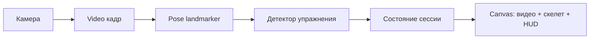

# Workout Counter React

Веб-приложение для подсчёта повторений по веб-камере с помощью MediaPipe Pose.

## Что умеет сейчас

- Рисует видео и скелет позы в одном `canvas` (отдельный элемент `<video>` в интерфейсе не показывается).
- Считает повторения для подъёма на бицепс, приседаний, армейского жима и наклонов головы вправо-влево; показывает фазы, confidence и диагностические углы в HUD.
- **Озвучка повторений** на русском через Web Speech API: после каждого засчитанного повтора произносится число (если синтез речи поддерживается браузером).
- **Таймер отдыха** после остановки сессии (кнопка «Стоп»): длительность задаётся выпадающим списком «Отдых» (1, 2, 3 или 5 минут, по умолчанию 3). На `canvas` отображается кольцевой прогресс и оставшееся время; в начале и в конце отдыха — короткие голосовые подсказки.
- **Голосовое управление** (Web Speech API, русский язык; логика в `useSpeechRecognition`): старт (после паузы возобновляет текущую сессию), пауза, сброс счётчика, завершение сессии голосом (`стоп`, `стоп упражнение`, `закончи упражнение`) с переходом к отдыху, выбор длительности отдыха голосом, переключение упражнения по имени и синонимам. Статус микрофона и распознавания отображается в строке состояния.

Подробный справочник фраз: [docs/voice-commands.md](docs/voice-commands.md). Требования к браузеру, камере и микрофону: [docs/browser-requirements.md](docs/browser-requirements.md). Архитектурная документация: [docs/architecture.md](docs/architecture.md). Структура папок `logic` / `contexts` / `selectors` / `containers`: [docs/src-layout.md](docs/src-layout.md). Доменные модули (`src/modules`, алиас `@modules`): [docs/modules.md](docs/modules.md). Алиасы путей (`@api`, `@utils`, …) и относительные импорты с `..`: [docs/import-aliases.md](docs/import-aliases.md). Конституция проекта: [CONSTITUTION.md](CONSTITUTION.md).

Идеи и бэклог развития продукта — в [todo.md](todo.md) (таблица: направления, признак готовности; полный список не дублируется в README).

## Функции приложения (UI и сценарии)

- **Выбор упражнения:** выпадающий список заполняется автоматически из детекторов с **истинным** `isActive` (в проекте — явное `isActive: true`); при `false` или без поля детектор в реестр не попадает. В ходе активной сессии список блокируется.
- **Управление сессией:** одна кнопка переключается между `Старт` и `Пауза`: первый запуск и возобновление после паузы — это `Старт`, во время активного выполнения та же кнопка становится `Пауза`. `Сброс` и `Стоп` доступны только во время активного выполнения (пока на основной кнопке отображается «Пауза»); в простое, на паузе и на таймере отдыха они неактивны. `Сброс` обнуляет счётчик и фазу.
- **Пауза и продолжение:** при паузе обработка кадров останавливается, в сцене показывается состояние «Упражнение приостановлено», затем снова `Старт` на той же кнопке продолжает ту же сессию.
- **Остановка сессии:** кнопка `Стоп` завершает сессию, отключает камеру и запускает таймер отдыха на выбранное время.
- **Строка состояния:** показывает готовность модели, состояние камеры, статус голосового распознавания, паузу и ошибки камеры.
- **Несколько страниц:** переключение через навигацию в шапке (React Router). Полная логика тренировки (камера, сессия, голос) монтируется только на главной (`HomePage`); остальные маршруты — отдельные экраны без `WorkoutLogicLayout`.

## Запуск

```bash
npm install
npm run dev
```

Откройте URL из Vite в браузере. Для камеры и (при голосовом управлении) микрофона браузер запросит разрешения. Для `getUserMedia` нужен **HTTPS** или **localhost**.

### API аутентификации (логин и пароль)

Фронтенд ходит к REST API по путям **`/api/...`** на том же origin, что и страница. В режиме разработки Vite **проксирует** префикс `/api` на процесс бэкенда (`vite.config.ts` → `127.0.0.1:3001`).

1. Установите зависимости сервера (отдельный `package.json` в каталоге `server/`):

   ```bash
   npm install --prefix server
   ```

2. Во втором терминале запустите API (по умолчанию порт **3001**, SQLite-файл в `server/data/app.sqlite`, не коммитится):

   ```bash
   npm run dev:api
   ```

3. В первом терминале как обычно: `npm run dev` — откройте приложение, страницы **«Вход»** и **«Регистрация»** в шапке.

Переменные окружения API (опционально):

| Переменная | Назначение |
|------------|------------|
| `PORT` | Порт HTTP (по умолчанию `3001`) |
| `DATABASE_PATH` | Путь к файлу SQLite (по умолчанию `./data/app.sqlite` относительно каталога `server/`) |
| `JWT_SECRET` | Секрет подписи JWT; в `production` обязателен |
| `COOKIE_SECURE` | Если `true`, cookie с флагом `Secure` (для HTTPS) |

Контракт эндпоинтов: [specs/features/_archive/auth-login-password/api-contract.md](specs/features/_archive/auth-login-password/api-contract.md).

## Docker (локально)

Нужны [Docker Engine](https://docs.docker.com/engine/install/) и (для Compose) [Docker Compose](https://docs.docker.com/compose/).

Сборка и запуск через Compose (SPA и API на **одном** origin — **http://localhost:8080**):

```bash
docker compose up --build
```

- Сервис **`web`** (nginx + собранный фронт) публикует порт **8080** на хост.
- Сервис **`api`** (Node, каталог `server/`) обрабатывает префикс **`/api`**; **не** публикует порт наружу; данные SQLite лежат в именованном томе **`workout_sqlite`** (путь в контейнере задаётся через `DATABASE_PATH=/data/app.sqlite`).
- Перед первым запуском задайте надёжный **`JWT_SECRET`** в окружении (например файл `.env` рядом с `docker-compose.yml` или переменная в оболочке). Значение по умолчанию в compose небезопасно и только для локальной проверки.

Только фронтенд (без API в контейнере):

```bash
docker build -t workout-counter-react:local .
docker run --rm -p 8080:80 workout-counter-react:local
```

В этом режиме запросы к `/api` из браузера не попадут на бэкенд; для полного сценария входа и регистрации используйте **`docker compose`** или локальную пару Vite + `npm run dev:api`.

Образ `web`: multi-stage (Node — `npm ci` и `npm run build`, затем nginx со статикой из `dist/` и прокси `location /api` на сервис `api`, плюс fallback на `index.html` для маршрутов React Router). Камера и микрофон проверяйте в браузере по адресу **localhost** (как при `npm run dev`); доступ по IP в локальной сети может не дать secure context для медиа.

План и чеклист (архив): `specs/features/_archive/local-docker-deploy/`.

## Скрипты

- `npm run dev` — локальная разработка (Vite).
- `npm run dev:api` — только HTTP API из каталога `server/` (порт по умолчанию 3001; совместно с `npm run dev` даёт один origin за счёт прокси Vite).
- `npm run build` — проверка TypeScript и production-сборка.
- `npm run build:analyze` — та же сборка в режиме `analyze`: дополнительно пишется отчёт **`dist/bundle-stats.html`** (дерево чанков и размеры; откройте файл в браузере после сборки).
- `npm run preview` — локальный просмотр уже собранного приложения (после `npm run build`).
- `npm run lint` — ESLint.
- `npm run test` — один прогон всех тестов (Vitest, `vitest run`).
- `npm run test:watch` — Vitest в режиме watch (`vitest`).
- `npm run test:coverage` — прогон с отчётом покрытия кода.
- `npm run commitlint` — проверка текста коммита через [commitlint](https://commitlint.js.org/) (сообщение передаётся в **stdin**).
- `npm run storybook` — [Storybook](https://storybook.js.org/) для изолированной разработки и документации UI (порт по умолчанию **6006**).
- `npm run build-storybook` — статическая сборка Storybook в **`storybook-static/`**.

Подробности по историям и соглашениям: [docs/storybook.md](docs/storybook.md).

Перед PR имеет смысл выполнить `npm run lint` и `npm run test`. Подробности: скрипты, расположение тестов, `setupTests`, хуки Husky (`pre-commit` / `commit-msg`), покрытие и типовые приёмы — в **[docs/testing.md](docs/testing.md)**.

### Линтинг и форматирование

- **ESLint** (flat config, `eslint.config.js`): рекомендованные правила TypeScript (`typescript-eslint`), React и React Hooks (`eslint-plugin-react`, `eslint-plugin-react-hooks`), обновление модулей Vite (`eslint-plugin-react-refresh`), сортировка импортов и экспортов (`eslint-plugin-simple-import-sort`), согласование с **Prettier** через `eslint-plugin-prettier` и `eslint-config-prettier` (конфликтующие стилевые правила ESLint отключены).
- **Prettier** — базовые настройки в [`.prettierrc.json`](.prettierrc.json); проверка форматирования входит в `npm run lint` (правило `prettier/prettier`). Автоисправление: `npx eslint . --fix` (поправит и порядок импортов, и формат там, где это безопасно).

Импорты между верхнеуровневыми папками `src` и соглашения про `..` — по-прежнему в [docs/import-aliases.md](docs/import-aliases.md); при расхождениях сначала выравнивайте порядок по сообщению линтера, затем по документу.

Размеры сгенерированных JS-чанков удобно смотреть в логе после `npm run build` (строки вида `dist/assets/…`) и при необходимости через `npm run build:analyze` и отчёт `dist/bundle-stats.html`.

## Сообщения коммитов (Conventional Commits)

Формат заголовка коммита: **`type(scope): subject`**. Поле **`scope`** необязательно: допустимы, например, `feat: добавить таймер` и `fix(ui): поправить отступ`.

**Часто используемые `type`:** `feat`, `fix`, `docs`, `refactor`, `test`, `chore` (а также, при необходимости, `build`, `ci`, `perf`, `style` и др. — см. [Conventional Commits](https://www.conventionalcommits.org/)).

После `npm install` [Husky](https://github.com/typicode/husky) подключает git hooks: **`commit-msg`** (commitlint) и **`pre-commit`** (линт и `vitest run --changed` — см. [docs/testing.md](docs/testing.md)). Несоответствующее сообщение коммит не пропустит. Обойти проверку для разового коммита можно только осознанно (`git commit --no-verify` — не злоупотребляйте).

**Примеры для этого репозитория**

- `feat: озвучивать число повторов после каждого засчитанного подхода`
- `fix: не сбрасывать фазу при паузе сессии`
- `docs: описать голосовые команды в voice-commands`
- `refactor: вынести селектор панели упражнения в отдельный модуль`
- `test: покрыть детектор приседаний граничными углами`
- `chore: обновить зависимости Vite`

**Некорректно:** `wip`, `fixed stuff`, `Update App.tsx` (нет типа и двоеточия в нужном месте).

**Ручная проверка без коммита:** передайте одну строку заголовка в stdin, например в PowerShell: `"feat: проверка" | npm run commitlint`. Для проверки содержимого файла (как делает git): `.\node_modules\.bin\commitlint.cmd --edit путь\к\файлу` (в Git Bash: `npx commitlint --edit путь/к/файлу`).

## Политика зависимостей

- Фиксируйте только **конкретные версии** пакетов в `package.json` (без `^`, `~`, `>=` и других диапазонов).
- Для npm в репозитории включён `save-exact=true` (`.npmrc`), чтобы новые зависимости сразу сохранялись как exact.
- После **любого** изменения зависимостей (`package.json`, `package-lock.json`) выполняйте только «чистую» переустановку:

```bash
rm -rf node_modules package-lock.json
npm install
```

Установка поверх существующих `node_modules` после изменения пакетов не считается надёжной и не используется в проекте.

## Планирование фич и исправлений

Планы и чеклисты лежат в каталоге [`specs/`](specs/README.md) (`specs/features`, `specs/fixes`, при необходимости `specs/refactor` — см. правило в `.cursor/rules/feature-planning.mdc`).

**Ветка git:** каждая фича, каждое исправление и каждый рефакторинг, оформленные через `specs/features/`, `specs/fixes/` или `specs/refactor/`, делаются в **отдельной ветке** от основной (например `feature/…`, `fix/…`, `refactor/…` — по смыслу и имени каталога спека). Все три коммита цикла задачи — в этой ветке; в основную ветку — после ревью слиянием. Подробнее для людей и для ИИ: `.cursor/rules/work-in-branch.mdc`.

Для **каждой задачи с изменением продукта** сначала заводите в репозитории пару артефактов (план и чеклист), затем делайте реализацию в коде:

1. **План** — контекст, цели, этапы и критерии готовности (markdown).
2. **Задачи реализации** — чеклист конкретных шагов со ссылкой на план.

Используйте отдельные каталоги по типу задачи:

- `specs/features/<краткое-имя>/` — новая функциональность или заметное расширение поведения.
- `specs/fixes/<краткое-имя>/` — исправление, которое не является новой фичей.
- `specs/refactor/<краткое-имя>/` — рефакторинг структуры кода **без** изменения наблюдаемого поведения продукта (тот же цикл: план, реализация, архивирование в `specs/refactor/_archive/`).
- Любой **hotfix/хотфикс** (включая быстрый визуальный hotfix в UI/CSS) считается **исправлением** и оформляется через `specs/fixes/<краткое-имя>/` с тем же циклом из трёх коммитов: план, реализация, архивирование.

Подробности и правила архивации: `specs/features/README.md`, `specs/fixes/README.md`, `specs/refactor/README.md`.

Пути к файлам в markdown в планах и архиве: без цепочек `../` — см. [docs/markdown-paths.md](docs/markdown-paths.md).

**GitHub:** при желании вести эпик как **Milestone** с набором **Issues** и при необходимости **Wiki** — см. [docs/github-planning.md](docs/github-planning.md) и шаблоны в `.github/ISSUE_TEMPLATE/`. Спеки в `specs/…` остаются обязательным шагом до кода; Issues на GitHub их дополняют.

**Коммиты по задаче (три штуки):** (1) только план и чеклист в каталоге задачи; (2) реализация (код, тесты, документация по чеклисту), без архивации; (3) только перенос каталога задачи в соответствующий `_archive` и правка относительных путей в её markdown. Не объединяйте эти этапы в одном коммите.

**После реализации** (чеклист закрыт, результат в коде и документации согласован) **перенесите** каталог задачи в архив: `specs/features/_archive/<то же имя>/` для фич, `specs/fixes/_archive/<то же имя>/` для исправлений или `specs/refactor/_archive/<то же имя>/` для рефакторинга. В архиве план остаётся для истории; активная работа ведётся только в активных каталогах вне `_archive`.

Пример оформления завершённой фичи: [documentation-update-plan.md (архив)](specs/features/_archive/documentation/documentation-update-plan.md), [documentation-implementation-tasks.md (архив)](specs/features/_archive/documentation/documentation-implementation-tasks.md).

## Стек

React 19, TypeScript, Vite 8, styled-components, MediaPipe Tasks Vision (pose landmarker heavy с откатом на lite при недоступности GPU), Vitest (см. [docs/testing.md](docs/testing.md)).

## Архитектура

- `src/main.tsx` — монтирование в `#root`: рендер `<App />` из `./App` (баррель `src/App/`).
- `src/App/App.tsx` — `ThemeProvider`, `GlobalStyle` и `RouterProvider` с `createBrowserRouter`: общий родительский маршрут с `AppPageLayout` (навигация и вложенные страницы через `<Outlet />`), дочерние маршруты — из `src/routes`.
- `src/routes/routes.ts` — собирает `RouteObject[]` из экспорта `routes` в каждом `src/pages/*/index.tsx` (`import.meta.glob`), строит `navItems` для `AppNav` из `route.handle.nav` (метка, порядок, `end`).
- `src/pages/HomePage/HomePage.tsx` — тонкая обёртка над `HomeModule` из `@modules/HomeModule`. Экран тренировки: `WorkoutLogicLayout` оборачивает `HomeLayout`; слоты (`header`, `controls`, `statusBar`, `stage`) заполняются контейнерами из `modules/HomeModule/containers`. Остальные страницы (`AdminPage`, `ExerciseHistoryPage` и т.д.) рендерятся тем же роутером без `WorkoutLogicLayout`. Подробнее о папках: [docs/src-layout.md](docs/src-layout.md).
- `src/store` — Redux store; срез `home` — поля панели и статусов главной (название не связано с браузером Chrome; см. [docs/architecture.md](docs/architecture.md)), тип `WorkoutSessionControlsAction` для команд сессии через `eventBus`.
- `src/theme` — объект темы (палитра, отступы, радиусы, типографика); `ThemeProvider` и `GlobalStyle` подключаются в `src/App/App.tsx`.
- `src/modules/HomeModule/logic` — оркестрация экрана тренировки (`WorkoutLogicLayout`: `useWorkoutSession`, `useSpeechRecognition`, подписка на `eventBus` для команд сессии, провайдер `WorkoutSessionStageContext`, синхронизация полей панели в Redux через `updateHomeModuleState`). Баррель `modules/HomeModule/logic/index.ts` — в т.ч. `useStageContainerSelector` и типы сцены.
- `src/modules/HomeModule/contexts` — React-контекст сцены (`WorkoutSessionStage`); отображаемое состояние панели/статуса — в `src/store` (срез `home`). Баррель `modules/HomeModule/contexts/index.ts`.
- `src/modules/HomeModule/selectors` — мемо-селекторы `get…ContainerProps` для Redux + `useStageContainerSelector` для сцены; баррель `modules/HomeModule/selectors/index.ts`.
- `src/modules/HomeModule/containers` — слоты `HomeLayout` без пропсов данных сессии; данные через селекторы. Баррель `modules/HomeModule/containers/index.ts`.
- `src/modules/HomeModule/hooks/useCameraStream.ts` — запуск и остановка потока с камеры.
- `src/modules/HomeModule/services` — MediaPipe Pose landmarker (`PoseLandmarkerService`): загрузка модели, `detect` / нормализация landmarks в общие типы из `src/utils/pose.ts`.
- `src/modules/HomeModule/exercises` — детекторы упражнений (`ExerciseDetector`), реестр `registry.ts`, типы.
- `src/utils` — утилиты: в частности `pose.ts` (типы позы, индексы точек, углы, `drawFrame` — видео, скелет, HUD на canvas), `canvas.ts` (`resizeCanvas`, экран отдыха `drawRestCountdown`), `speech.ts` (синтез и нормализация текста для команд).
- `src/modules/HomeModule/hooks/useSpeechRecognition.ts` — непрерывное распознавание речи: команды сессии через `eventBus`, смена упражнения/отдыха через `updateHomeModuleState` (вызывается из `WorkoutLogicLayout`, не из корневого `App`).
- `src/types` — общие типы приложения (в том числе единый тип статусов `EntityStatus`, снимок рантайма детектора `ExerciseRuntimeState` для HUD и `utils/pose`).
- `src/modules/HomeModule/hooks/useWorkoutSession.ts` — **ядро сессии**: связывает камеру, landmarker, выбранный детектор и отрисовку; управляет циклом `requestAnimationFrame`, паузой, сбросом, остановкой с таймером отдыха и озвучкой повторений.

## Соглашение по импортам

- Между **верхнеуровневыми** папками `src/*` используйте префиксы-алиасы (`@api`, `@utils`, `@types`, `@store`, …) и импорт **из папки (барреля)**, а не из конкретного файла, если сущность уже в барреле. Комбинированные селекторы под **App** и **модули** живут рядом с кодом: `src/App/selectors/`, `src/modules/<ИмяModule>/selectors/`. Таблица алиасов и путей внутри `HomeModule`: [docs/import-aliases.md](docs/import-aliases.md).
- Публичные точки входа модулей определяются через `index.ts` в соответствующей папке.
- Если сущность должна использоваться извне папки, добавляйте её явный именованный реэкспорт в `index.ts` этой папки.
- В `index.ts` не используйте `export *`; перечисляйте публичный API явно (`export { ... }`, `export type { ... }`).

### UI-компоненты (`src/components`)

Переиспользуемые блоки интерфейса оформляются по соглашению: одна папка на компонент (PascalCase), стили в **`<Name>.styled.tsx`** (**styled-components**, токены из темы), баррели `index.ts` в папке и в `src/components/index.ts`, импорт в приложении из `./components`. Подробности: [docs/components.md](docs/components.md).

### Логика экрана, контексты, селекторы, контейнеры (главная)

Каталоги **`modules/HomeModule/logic`**, **`modules/HomeModule/contexts`**, **`modules/HomeModule/selectors`**, **`modules/HomeModule/containers`**, а также **`modules/HomeModule/hooks`**, **`modules/HomeModule/exercises`**, **`modules/HomeModule/services`**: подпапки в PascalCase, в каждой подсистеме свой баррель `index.ts` (где применимо), импорты между верхнеуровневыми папками `src/*` — только из баррелей, без `export *`. Подробности и таблица «куда класть новое»: [docs/src-layout.md](docs/src-layout.md).

### Поток данных



Кратко: кадр с камеры → оценка позы → обновление детектора и счётчика повторов → отрисовка на canvas.

## Голосовое управление (кратко)

Распознавание непрерывное; между одинаковыми командами действует короткая задержка (антидребезг). Команды смены упражнения строятся из `name` и поля `voiceAliases` каждого детектора (см. `src/modules/HomeModule/exercises/types.ts`).

Полный перечень фраз и пояснения по статусам — в [docs/voice-commands.md](docs/voice-commands.md).

## Таймер отдыха

- **UI:** поле «Отдых» задаёт длительность в минутах для следующего отдыха.
- **Поведение:** по нажатию «Стоп» сессия останавливается, камера отключается, на пустом canvas показывается обратный отсчёт с кольцом прогресса. Во время этого отсчёта и до следующего «Старт» кнопки «Сброс» и «Стоп» неактивны (как и в простое и на паузе).
- **Голос:** можно сказать, например, «отдых три минуты» — длительность применится при следующем завершении сессии кнопкой «Стоп» или соответствующей голосовой командой (см. таблицу в [docs/voice-commands.md](docs/voice-commands.md)).

## Как добавить новое упражнение

1. Создайте файл в `src/modules/HomeModule/exercises/` (например подпапка детектора с `*Detector.ts`).
2. Реализуйте интерфейс `ExerciseDetector` из `src/modules/HomeModule/exercises/types.ts`:
   - `id`, `name`, `description`;
   - `isActive: true`, чтобы детектор попал в реестр, список упражнений и голосовой выбор; `false` или отсутствие поля — детектор отфильтровывается;
   - по желанию `voiceAliases` — фразы для голосового переключения на это упражнение;
   - `createState()` и `update(landmarks, state)` с возвратом фазы, confidence, метрик и `repDelta`.
3. Сохраните файл детектора с суффиксом `*Detector.ts` под `src/modules/HomeModule/exercises` (в т.ч. во вложенной папке): реестр подхватит его автоматически.
4. Добавьте или расширьте тесты в `src/modules/HomeModule/exercises/__tests__/detectors.test.ts` (или отдельном файле рядом), чтобы зафиксировать пороги и сценарии счёта.
5. При `isActive: true` новое упражнение появится в выпадающем списке и будет доступно для голосового выбора.

Пороговые углы и видимость ключевых точек задаются в коде конкретного детектора.

## Примечания

- По умолчанию загружается тяжёлая модель pose landmarker; при ошибке инициализации с GPU используется lite-модель на CPU (`@mediapipe/tasks-vision`).
- Значимые изменения в поведении UI или в наборе голосовых команд желательно сопровождать обновлением README и при необходимости [docs/voice-commands.md](docs/voice-commands.md).
