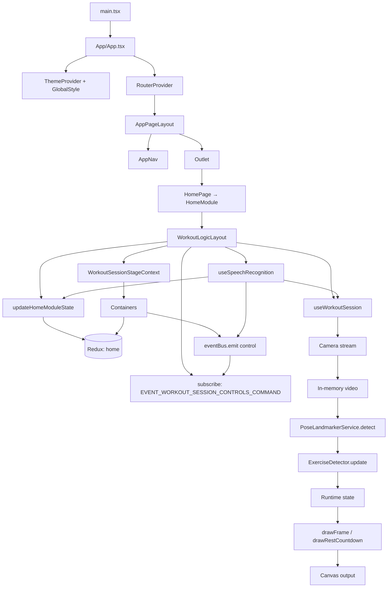

# Архитектура приложения

Документ описывает текущую архитектуру `workout-counter-react`: основные модули, поток данных и жизненный цикл сессии.

## Назначение

Приложение считает повторения упражнений по веб-камере с помощью MediaPipe Pose, рисует состояние в `canvas`, поддерживает голосовые команды и таймер отдыха.

## Слои и зоны ответственности

- `src/main.tsx`
  - Точка входа в DOM: `createRoot`, рендер публичного `<App />` из `./App` (баррель `src/App/index.ts`).

- `src/App/*`
  - **`App.tsx`:** `ThemeProvider`, `GlobalStyle`, `RouterProvider` с `createBrowserRouter` — родительский маршрут с `element: <AppPageLayout />`, дочерние маршруты из массива `routes` (`src/routes`). Без хуков сессии и голоса.
  - **`AppPageLayout.tsx`:** оболочка вложенных маршрутов: `AppNav` (пункты из `navItems`) и `<Outlet />`.
  - Публичный API папки: `src/App/index.ts`.

- `src/routes/routes.ts`
  - Сборка списка маршрутов: `import.meta.glob` по `../pages/*/index.tsx`, объединение экспортов `routes`; функция `buildNavItems` читает `route.handle.nav` для навигации.

- `src/pages/*`
  - Страницы приложения. Каждая подпапка страницы может экспортировать массив **`routes`** (`RouteObject[]`) из своего `index.tsx` — он попадает в общий роутер.
  - **`HomePage` / `HomeModule`:** маршрут главной — `HomePage` рендерит **`HomeModule`** из `src/modules/HomeModule`. Это единственный экран с полной оркестрацией тренировки — внутри `WorkoutLogicLayout` и **`HomeLayout`** (слоты `header`, `controls`, `statusBar`, `stage`); в слоты передаются контейнеры из `modules/HomeModule/containers`.
  - Прочие страницы (например админка, история) — презентационный контент без `WorkoutLogicLayout` (часто через свои модули в `src/modules`).

- `src/modules/HomeModule/logic/*`
  - Оркестрация экрана тренировки: `WorkoutLogicLayout` (`useWorkoutSession`, `useSpeechRecognition`, подписка на `eventBus` для команд сессии, провайдер `WorkoutSessionStageContext`, синхронизация полей панели и статусов в Redux через `updateHomeModuleState`). Один публичный модуль — подпапка PascalCase + `modules/HomeModule/logic/index.ts`. Соглашения — в [docs/src-layout.md](src-layout.md).

- `src/modules/HomeModule/contexts/*`
  - React-контекст сцены (`WorkoutSessionStage`: `canvasRef`, флаги паузы/инициализации камеры). Состояние панели и статусов (модель, камера, голос, `exerciseId`, длительность отдыха и т.д.) — в **Redux** (`home`), не в контексте. Подпапка на контекст, баррель `modules/HomeModule/contexts/index.ts`.

- `src/modules/HomeModule/selectors/*`
  - Селекторы для контейнеров: для данных из стора — мемоизированные селекторы **`get…ContainerProps`** (`@reduxjs/toolkit` `createSelector`) + `useAppSelector` в контейнере; для сцены — хук **`useStageContainerSelector`** (читает `WorkoutSessionStageContext`). Подпапка на селектор, баррель `modules/HomeModule/selectors/index.ts`; часть API реэкспортируется из `modules/HomeModule/logic/index.ts`.

- `src/modules/HomeModule/containers/*`
  - Компоненты слотов layout главной страницы (`HomeLayout`: `header`, `controls`, `statusBar`, `stage`) без пропсов данных сессии; данные из Redux- и контекст-селекторов, команды сессии — `eventBus` и/или `updateHomeModuleState` (см. раздел **Срез controls и команды сессии**). Одна папка на контейнер, баррель `modules/HomeModule/containers/index.ts`. Соглашения — в [docs/src-layout.md](src-layout.md).

- `src/store/*`
  - Redux store приложения. Срез **`home`** хранит поля панели и статусов сессии (`exerciseId`, `restDurationMinutes`, `isRunning`, статусы модели/камеры/голоса и т.д.); **`WorkoutSessionControlsAction`** (union команд сессии для `eventBus`) задаётся в `src/store/home/controlActionTypes.ts` и реэкспортируется из `src/store/index.ts`.

- `src/utils/eventBus` и `src/modules/HomeModule/constants`
  - Команды **`start` / `pause` / `reset` / `shutdown`** доставляются в **`WorkoutLogicLayout`** через **`eventBus`** с именем события **`EVENT_WORKOUT_SESSION_CONTROLS_COMMAND`** (`HomeModuleConstants` / `HomeModule/constants`).

- `src/components/*`
  - Переиспользуемые UI-блоки (например выбор значения, кнопки панели управления): одна папка на компонент, оформление через **`<Имя>.styled.tsx`** и токены из темы (`src/theme`), импорт из барреля `./components`. Соглашения — в [docs/components.md](components.md).

- `src/theme/*`
  - Базовая тема приложения (`theme.ts`), глобальные стили (`createGlobalStyle` в `globalStyle.tsx`), расширение типа `DefaultTheme` для TypeScript (`styled.d.ts`). Провайдер темы подключается в `src/App/App.tsx`.

- `src/modules/HomeModule/hooks/useSpeechRecognition.ts`
  - Web Speech API: запуск распознавания, разбор транскрипта. Команды `start` / `pause` / `reset` / `shutdown` — **`eventBus.emit(EVENT_WORKOUT_SESSION_CONTROLS_COMMAND, …)`** с **`WorkoutSessionControlsAction`**. Смена упражнения и длительности отдыха — **`dispatch(updateHomeModuleState({ … }))`** (как в `ExerciseControlBarContainer`); связка «отдых N минут» — `patch` + `shutdown` с `restDurationOverrideMs`.

- `src/modules/HomeModule/hooks/useWorkoutSession.ts`
  - Оркестратор тренировки: связывает камеру, `PoseLandmarkerService`, детектор и отрисовку (`drawFrame`, `drawRestCountdown` из `src/utils`).
  - Управляет состоянием сессии: запуск, пауза, возобновление, сброс, остановка камеры.
  - Запускает цикл `requestAnimationFrame`, считает `repDelta`, озвучивает повторы.
  - Запускает и рендерит таймер отдыха после остановки.

- `src/modules/HomeModule/hooks/useCameraStream.ts`
  - Работа с `getUserMedia`: старт/стоп потока и диагностика ошибок камеры.

- `src/modules/HomeModule/services/*`
  - `PoseLandmarkerService`: инициализация MediaPipe Tasks Vision (модель heavy, при сбое — lite на CPU), `detectForVideo`, нормализация landmarks в типы из `src/utils/pose.ts`.

- `src/utils/pose.ts`
  - Типы `PosePoint`, `PoseLandmarks`, `PoseFrame`; константа индексов `POSE_INDEX`; `getPoint`, `calculateAngle` для детекторов; отрисовка кадра `drawFrame` (видео «cover», скелет, HUD).

- `src/utils/canvas.ts`
  - Подгонка размера canvas под DPR, очистка, `computeCoverLayout`, экран отдыха `drawRestCountdown`.

- `src/modules/HomeModule/exercises/`
  - `types.ts`, баррель `index.ts`, `registry.ts`: `import.meta.glob` по `./**/*Detector.ts`, фильтр по истинному `isActive`, сортировка по **`order`**, при равенстве — по **`id`**.
  - Каждый детектор — подпапка в PascalCase (`ArmyPressDetector/`, `BicepsCurlDetector/`, …): файл `*Detector.ts` и `index.ts`; общий интерфейс из `types.ts`; математика по точкам из `src/utils` (`POSE_INDEX`, `getPoint`, `calculateAngle`).

- `src/types/*`
  - Общие типы приложения, включая единый тип статусов `EntityStatus`, который используется в модели и камере, и **`ExerciseRuntimeState`** (HUD и отрисовка в `utils/pose`).

## Поток данных

Ключевой цикл тренировки: кадр с камеры → landmarks → детектор упражнения → обновление runtime → рендер в canvas. Состояние панели и статус-бара читается контейнерами из **Redux** через мемо-селекторы; контекст **`WorkoutSessionStageContext`** отдаёт ссылку на canvas и флаги для сцены. Команды сессии (`start` и т.д.) **не** хранятся в сторе: панель и голос **эмитят** событие в **`eventBus`**, а **`WorkoutLogicLayout`** подписан и вызывает методы **`useWorkoutSession`**. Корневой `App` и `AppPageLayout` к этому циклу не подключены — они задают тему, роутинг и оболочку страниц.

### Срез controls и команды сессии: Redux, `eventBus` и `WorkoutSessionControlsAction`

- **Чтение UI:** срез **`home`** в **Redux** (`src/store/home/`) — `exerciseId`, `restDurationMinutes`, `isRunning`, флаги готовности, статусы модели, камеры, голоса и т.д. Контейнеры подключают данные через **`getExerciseControlBarContainerProps`** / **`getStatusBarContainerProps`** + **`useAppSelector`**.
- **Изменение упражнения и длительности отдыха (без перезапуска сессии):** прямой **`dispatch(updateHomeModuleState({ exerciseId | restDurationMinutes }))`** — в **`ExerciseControlBarContainer`** и в **`useSpeechRecognition`** (выбор упражнения голосом, смена минут отдыха).
- **Команды сессии** (`start`, `pause`, `reset`, `shutdown`) — дискриминирующий union **`WorkoutSessionControlsAction`** в **`src/store/home/controlActionTypes.ts`**, реэкспортируется из **`src/store/index.ts`**. Потребители **эмитят** payload через **`eventBus.emit(EVENT_WORKOUT_SESSION_CONTROLS_COMMAND, action)`**; в **`WorkoutLogicLayout`** обработчик по **`action.type`** вызывает **`start`**, **`pause`**, **`reset`**, **`shutdown`** из **`useWorkoutSession`** (для `shutdown` — опционально **`restDurationOverrideMs`**).

| `action.type` | Назначение |
|----------------|------------|
| `start` | старт / возобновление сессии (асинхронная часть внутри `useWorkoutSession`) |
| `pause` | пауза |
| `reset` | сброс счётчика и фазы |
| `shutdown` | стоп + при необходимости таймер отдыха; опционально `restDurationOverrideMs` |

## Жизненный цикл сессии

- `Старт` (в UI — подпись на общей кнопке, когда сессия не в активном выполнении):
  - если сессия в паузе, происходит возобновление без сброса состояния;
  - иначе запускается камера, инициализируется состояние детектора, runtime обнуляется.
- `Пауза` (в UI — та же кнопка с подписью «Пауза», пока `isRunning`):
  - останавливает основной `requestAnimationFrame` цикл обработки.
- `Сброс`:
  - в UI и голосом доступен только при активном выполнении (`isRunning`);
  - обнуляет счётчик и фазу (состояние детектора пересоздаётся).
- `Стоп`:
  - в UI и голосом доступен только при активном выполнении (`isRunning`);
  - завершает сессию, останавливает камеру и запускает таймер отдыха.

## Голосовое управление в архитектуре

- Слой распознавания инкапсулирован в `useSpeechRecognition`; вызывается из `WorkoutLogicLayout` с флагами готовности (`isRunning`, `isRestCountdownActive`, камера, модель). Хук использует **`useAppDispatch`** для **`updateHomeModuleState`** и **`eventBus`** для команд сессии — тот же контракт, что у UI панели.
- Распознанные команды сессии эмитят **`WorkoutSessionControlsAction`**; связка «отдых N минут» — **`updateHomeModuleState({ restDurationMinutes })`** и затем **`shutdown`** с соответствующим **`restDurationOverrideMs`**.
- Для предотвращения ложных многократных срабатываний применяется cooldown по ключу команды.

## Контракты расширения

- Новый детектор должен реализовать `ExerciseDetector`:
  - `id`, `name`, `description`,
  - `createState()`,
  - `update(landmarks, state) -> { nextState, repDelta, phase, metrics, confidence }`.
- Для голосового выбора упражнения поддерживается `voiceAliases`.
- Для временного скрытия упражнения из UI/голоса используйте `isActive: false`.

## Именование: `home`

Срез **`home`** и префикс **Controls** в типах относятся к **панели управления и строке статусов** вокруг сцены тренировки (см. слоты `HomeLayout`: `controls`, `statusBar`). Это **не** браузер Google Chrome и не «chrome» в смысле оформления окна; термин выбран как короткое имя для этого слоя UI. Команды **`start` / `pause` / `reset` / `shutdown`** в стор **не** кладутся: их несёт **`eventBus`** (`EVENT_WORKOUT_SESSION_CONTROLS_COMMAND`, payload — **`WorkoutSessionControlsAction`**).

## Нефункциональные ограничения

- Для камеры требуется `HTTPS` или `localhost`.
- Голосовое управление зависит от поддержки Web Speech API браузером.
- Производительность и стабильность счёта зависят от качества видео и видимости ключевых точек.
