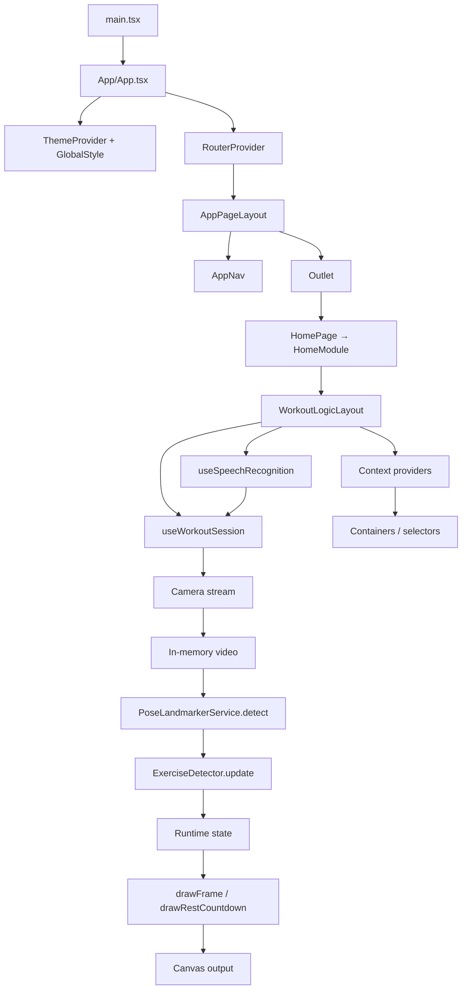

# Архитектура приложения

Документ описывает текущую архитектуру `workout-counter-react`: основные модули, поток данных и жизненный цикл сессии.

## Назначение

Приложение считает повторения упражнений по веб-камере с помощью MediaPipe Pose, рисует состояние в `canvas`, поддерживает голосовые команды и таймер отдыха.

## Слои и зоны ответственности

- `src/main.tsx`
  - Точка входа в DOM: `createRoot`, рендер публичного `<App />` из `./App` (баррель `src/App/index.ts`).

- `src/App/*`
  - **`App.tsx`:** `ThemeProvider`, `GlobalStyle`, `RouterProvider` с `createBrowserRouter` — родительский маршрут с `element: <AppPageLayout />`, дочерние маршруты из массива `routes` (`src/routes`). Без хуков сессии и голоса.
  - **`AppPageLayout.tsx`:** оболочка вложенных маршрутов: `AppNav` (пункты из `navItems`) и `<Outlet />`.
  - Публичный API папки: `src/App/index.ts`.

- `src/routes/routes.ts`
  - Сборка списка маршрутов: `import.meta.glob` по `../pages/*/index.tsx`, объединение экспортов `routes`; функция `buildNavItems` читает `route.handle.nav` для навигации.

- `src/pages/*`
  - Страницы приложения. Каждая подпапка страницы может экспортировать массив **`routes`** (`RouteObject[]`) из своего `index.tsx` — он попадает в общий роутер.
  - **`HomePage` / `HomeModule`:** маршрут главной — `HomePage` рендерит **`HomeModule`** из `src/modules/HomeModule`. Это единственный экран с полной оркестрацией тренировки — внутри `WorkoutLogicLayout` и **`HomeLayout`** (слоты `header`, `controls`, `statusBar`, `stage`); в слоты передаются контейнеры из `modules/HomeModule/containers`.
  - Прочие страницы (например админка, история) — презентационный контент без `WorkoutLogicLayout` (часто через свои модули в `src/modules`).

- `src/modules/HomeModule/logic/*`
  - Оркестрация экрана тренировки: `WorkoutLogicLayout` (состояние упражнения/отдыха, `useWorkoutSession`, `useSpeechRecognition`, провайдеры контекстов). Один публичный модуль — подпапка PascalCase + `modules/HomeModule/logic/index.ts`. Соглашения — в [docs/src-layout.md](src-layout.md).

- `src/modules/HomeModule/contexts/*`
  - React-контексты значений сессии главной (разделение chrome / stage и т.д.): подпапка на контекст, баррель `modules/HomeModule/contexts/index.ts`.

- `src/modules/HomeModule/selectors/*`
  - Хуки `use…ContainerSelector` для контейнеров (`useContext` + `useMemo`); подпапка на селектор, баррель `modules/HomeModule/selectors/index.ts`; для контейнеров реэкспорт через `modules/HomeModule/logic/index.ts`.

- `src/modules/HomeModule/containers/*`
  - Компоненты слотов layout главной страницы (`HomeLayout`: `controls`, `statusBar`, `stage` и т.д.) без пропсов данных сессии; данные через селекторы. Одна папка на контейнер, баррель `modules/HomeModule/containers/index.ts`. Соглашения — в [docs/src-layout.md](src-layout.md).

- `src/components/*`
  - Переиспользуемые UI-блоки (например выбор значения, кнопки панели управления): одна папка на компонент, оформление через **`<Имя>.styled.tsx`** и токены из темы (`src/theme`), импорт из барреля `./components`. Соглашения — в [docs/components.md](components.md).

- `src/theme/*`
  - Базовая тема приложения (`theme.ts`), глобальные стили (`createGlobalStyle` в `globalStyle.tsx`), расширение типа `DefaultTheme` для TypeScript (`styled.d.ts`). Провайдер темы подключается в `src/App/App.tsx`.

- `src/modules/HomeModule/hooks/useSpeechRecognition.ts`
  - Web Speech API: запуск распознавания, разбор транскрипта; команды и смена упражнения / длительности отдыха сводятся к вызовам **`dispatchChromeControl`** с объектами действий (тот же контракт, что у панели управления через контекст).

- `src/modules/HomeModule/hooks/useWorkoutSession.ts`
  - Оркестратор тренировки: связывает камеру, `PoseLandmarkerService`, детектор и отрисовку (`drawFrame`, `drawRestCountdown` из `src/utils`).
  - Управляет состоянием сессии: запуск, пауза, возобновление, сброс, остановка камеры.
  - Запускает цикл `requestAnimationFrame`, считает `repDelta`, озвучивает повторы.
  - Запускает и рендерит таймер отдыха после остановки.

- `src/modules/HomeModule/hooks/useCameraStream.ts`
  - Работа с `getUserMedia`: старт/стоп потока и диагностика ошибок камеры.

- `src/modules/HomeModule/services/*`
  - `PoseLandmarkerService`: инициализация MediaPipe Tasks Vision (модель heavy, при сбое — lite на CPU), `detectForVideo`, нормализация landmarks в типы из `src/utils/pose.ts`.

- `src/utils/pose.ts`
  - Типы `PosePoint`, `PoseLandmarks`, `PoseFrame`; константа индексов `POSE_INDEX`; `getPoint`, `calculateAngle` для детекторов; отрисовка кадра `drawFrame` (видео «cover», скелет, HUD).

- `src/utils/canvas.ts`
  - Подгонка размера canvas под DPR, очистка, `computeCoverLayout`, экран отдыха `drawRestCountdown`.

- `src/modules/HomeModule/exercises/`
  - `types.ts`, баррель `index.ts`, `registry.ts`: `import.meta.glob` по `./**/*Detector.ts`, фильтр по истинному `isActive` (в детекторах проекта — `isActive: true`), сортировка по `id`.
  - Каждый детектор — подпапка в PascalCase (`ArmyPressDetector/`, `BicepsCurlDetector/`, …): файл `*Detector.ts` и `index.ts`; общий интерфейс из `types.ts`; математика по точкам из `src/utils` (`POSE_INDEX`, `getPoint`, `calculateAngle`).

- `src/types/*`
  - Общие типы приложения, включая единый тип статусов `EntityStatus`, который используется в модели и камере, и **`ExerciseRuntimeState`** (HUD и отрисовка в `utils/pose`).

## Поток данных

Ключевой цикл тренировки: кадр с камеры → landmarks → детектор упражнения → обновление runtime → рендер в canvas. Контексты публикуются из `WorkoutLogicLayout` на маршруте главной; контейнеры читают срезы через `use…ContainerSelector`. Корневой `App` и `AppPageLayout` к этому циклу не подключены — они задают тему, роутинг и оболочку страниц.

### Chrome-контролы: `dispatchChromeControl`

Срез **`WorkoutSessionChromeControls`** отдаёт UI данные для панели (например `exerciseId`, `restDurationMinutes`, `isRunning`, флаги готовности) и **одну** функцию **`dispatchChromeControl(action)`**. Тип действия — дискриминирующий union **`WorkoutSessionChromeControlAction`** (`src/modules/HomeModule/contexts/WorkoutSessionChromeControls/types.ts`), реэкспортируется из `src/modules/HomeModule/contexts/index.ts` и при необходимости из `src/modules/HomeModule/logic/index.ts`:

| `action.type` | Назначение |
|----------------|------------|
| `start` | старт / возобновление сессии (асинхронная часть внутри `useWorkoutSession`) |
| `pause` | пауза |
| `reset` | сброс счётчика и фазы |
| `shutdown` | стоп + при необходимости таймер отдыха; опционально `restDurationOverrideMs` |
| `setExerciseId` | поле `exerciseId: string` |
| `setRestDurationMinutes` | поле `minutes: number` |

Реализация **`dispatchChromeControl`** собирается в **`WorkoutLogicLayout`** через **`useCallback`**: в **`switch`** по `action.type` вызываются методы **`useWorkoutSession`** и сеттеры локального состояния упражнения/отдыха. Потребители контекста (контейнер панели, голос) **не** получают отдельные колбэки `start` / `setExerciseId` и т.д. — только **`dispatchChromeControl`** и поля для отображения.

## Жизненный цикл сессии

- `Старт` (в UI — подпись на общей кнопке, когда сессия не в активном выполнении):
  - если сессия в паузе, происходит возобновление без сброса состояния;
  - иначе запускается камера, инициализируется состояние детектора, runtime обнуляется.
- `Пауза` (в UI — та же кнопка с подписью «Пауза», пока `isRunning`):
  - останавливает основной `requestAnimationFrame` цикл обработки.
- `Сброс`:
  - в UI и голосом доступен только при активном выполнении (`isRunning`);
  - обнуляет счётчик и фазу (состояние детектора пересоздаётся).
- `Стоп`:
  - в UI и голосом доступен только при активном выполнении (`isRunning`);
  - завершает сессию, останавливает камеру и запускает таймер отдыха.

## Голосовое управление в архитектуре

- Слой распознавания инкапсулирован в `useSpeechRecognition`; вызывается из `WorkoutLogicLayout`, который передаёт состояние сессии и **`dispatchChromeControl`** (ссылка синхронизируется через `ref` внутри хука).
- Распознанные команды превращаются в те же **`WorkoutSessionChromeControlAction`**, что и клики по панели (в т.ч. связка «отдых N минут»: `setRestDurationMinutes`, затем `shutdown` с `restDurationOverrideMs`).
- Для предотвращения ложных многократных срабатываний применяется cooldown по ключу команды.

## Контракты расширения

- Новый детектор должен реализовать `ExerciseDetector`:
  - `id`, `name`, `description`,
  - `createState()`,
  - `update(landmarks, state) -> { nextState, repDelta, phase, metrics, confidence }`.
- Для голосового выбора упражнения поддерживается `voiceAliases`.
- Для временного скрытия упражнения из UI/голоса используйте `isActive: false`.

## Нефункциональные ограничения

- Для камеры требуется `HTTPS` или `localhost`.
- Голосовое управление зависит от поддержки Web Speech API браузером.
- Производительность и стабильность счёта зависят от качества видео и видимости ключевых точек.
