# Архитектура приложения

Документ описывает текущую архитектуру `workout-counter-react`: основные модули, поток данных и жизненный цикл сессии.

## Назначение

Приложение считает повторения упражнений по веб-камере с помощью MediaPipe Pose, рисует состояние в `canvas`, поддерживает голосовые команды и таймер отдыха.

## Слои и зоны ответственности

- `src/App.tsx`
  - UI верхнего уровня: селекты, **одна кнопка «Старт / Пауза»** (переключение подписи и действия по `isRunning`), остальные кнопки сессии, строка состояния, canvas-сцена.
  - Интеграция голосового управления (`SpeechRecognition`): нормализация текста, матчинг команд, антидребезг.
  - Передача команд в хук сессии (`start`, `pause`, `reset`, `shutdown`).

- `src/hooks/useWorkoutSession.ts`
  - Оркестратор тренировки: связывает камеру, позу, детектор и рендер.
  - Управляет состоянием сессии: запуск, пауза, возобновление, сброс, остановка камеры.
  - Запускает цикл `requestAnimationFrame`, считает `repDelta`, озвучивает повторы.
  - Запускает и рендерит таймер отдыха после остановки.

- `src/hooks/useCameraStream.ts`
  - Работа с `getUserMedia`: старт/стоп потока и диагностика ошибок камеры.

- `src/pose/*`
  - `poseLandmarkerService`: инициализация и использование MediaPipe Tasks Vision.
  - `poseMath`: утилиты по landmarks (индексы точек, углы, выбор точек по visibility).

- `src/exercises/*`
  - Детекторы упражнений (`*Detector.ts`) реализуют общий интерфейс.
  - `registry.ts`: динамически находит детекторы, фильтрует `isActive !== false`, убирает дубликаты `id`, сортирует.

- `src/render/*`
  - `drawFrame`: отрисовка видео, скелета и HUD в `canvas`.
  - `drawRestCountdown`: отдельный рендер экрана отдыха.

- `src/types/*`
  - Общие типы приложения, включая единый тип статусов `AppStatus`, который используется в модели и камере.

## Поток данных

```mermaid
flowchart LR
  UI[UI / App.tsx] --> Session[useWorkoutSession]
  Session --> Camera[Camera stream]
  Camera --> Video[In-memory video]
  Video --> Pose[PoseLandmarkerService.detect]
  Pose --> Detector[ExerciseDetector.update]
  Detector --> Runtime[Runtime state]
  Runtime --> Render[drawFrame]
  Render --> Canvas[Canvas output]
```

Ключевой цикл: кадр с камеры -> landmarks -> детектор упражнения -> обновление runtime -> рендер в canvas.

## Жизненный цикл сессии

- `Старт` (в UI — подпись на общей кнопке, когда сессия не в активном выполнении):
  - если сессия в паузе, происходит возобновление без сброса состояния;
  - иначе запускается камера, инициализируется состояние детектора, runtime обнуляется.
- `Пауза` (в UI — та же кнопка с подписью «Пауза», пока `isRunning`):
  - останавливает основной `requestAnimationFrame` цикл обработки.
- `Сброс`:
  - в UI и голосом доступен только при активном выполнении (`isRunning`);
  - обнуляет счётчик и фазу (состояние детектора пересоздаётся).
- `Стоп`:
  - в UI и голосом доступен только при активном выполнении (`isRunning`);
  - завершает сессию, останавливает камеру и запускает таймер отдыха.

## Голосовое управление в архитектуре

- Слой распознавания находится в `App.tsx`, чтобы быть максимально близко к UI-командам.
- Команды транслируются в API сессии (`start/pause/reset/shutdown`) и выбор упражнения.
- Для предотвращения ложных многократных срабатываний применяется cooldown по ключу команды.

## Контракты расширения

- Новый детектор должен реализовать `ExerciseDetector`:
  - `id`, `name`, `description`,
  - `createState()`,
  - `update(landmarks, state) -> { nextState, repDelta, phase, metrics, confidence }`.
- Для голосового выбора упражнения поддерживается `voiceAliases`.
- Для временного скрытия упражнения из UI/голоса используйте `isActive: false`.

## Нефункциональные ограничения

- Для камеры требуется `HTTPS` или `localhost`.
- Голосовое управление зависит от поддержки Web Speech API браузером.
- Производительность и стабильность счёта зависят от качества видео и видимости ключевых точек.
