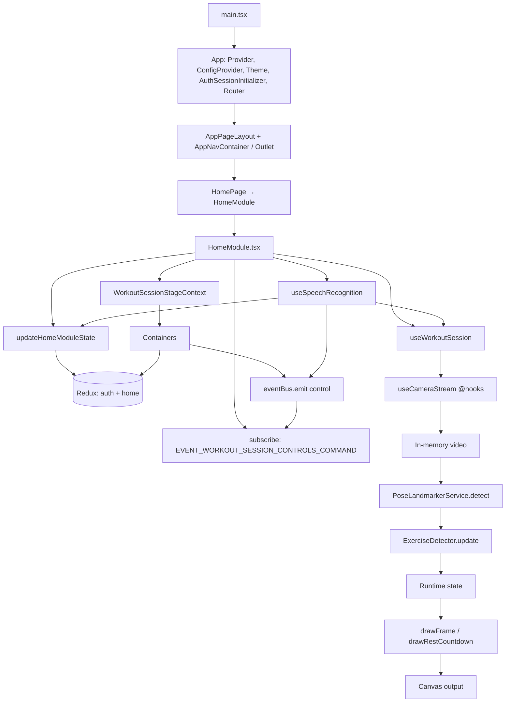

# Архитектура приложения

Документ описывает текущую архитектуру `workout-counter-react`: основные модули, поток данных и жизненный цикл сессии.

## Назначение

Приложение считает повторения упражнений по веб-камере с помощью MediaPipe Pose, рисует состояние в `canvas`, поддерживает голосовые команды и таймер отдыха.

## Слои и зоны ответственности

- `src/main.tsx`
  - Точка входа в DOM: `createRoot`, рендер публичного `<App />` из `./App` (баррель `src/App/index.ts`).

- `src/App/*`
  - **`App.tsx`:** обёртка **`Provider`** из `react-redux` (store), **`ConfigProvider`** Ant Design (тема из `getAntdThemeConfig` + `theme` styled-components), **`ThemeProvider`**, **`GlobalStyle`**, **`AuthSessionInitializer`** (диспатч `initializeAuth` при монтировании), **`RouterProvider`**. Дочерний `createBrowserRouter`: общий layout **`AppPageLayout header={<AppNavContainer />}`**; **публичные** маршруты из `publicAuthRoutes` (страницы с `handle.auth === 'public'`, сейчас **«Вход»** и **«Регистрация»**); остальные — под **`RequireAuth`**, внутри — `protectedAppRoutes` (тренировка, админка, история и catch-all). Без хуков сессии тренировки.
  - **`AppPageLayout`:** `Outlet` в оболочке; слот `header` — контейнер навигации.
  - **`AppNavContainer`:** `AppNav` с пунктами `navItems` **только если** пользователь вошёл; иначе в области авторизации — ссылки **«Вход»** / **«Регистрация»**; при `isLoading` сессия блока авторизации не показана. См. `getAppNavContainerProps` в `App/selectors`.
  - **`RequireAuth`:** при отсутствии пользователя — редирект на `/login` с `state.from`; при загрузке сессии — «Загрузка…».
  - Публичный API папки: `src/App/index.ts`.

- `src/routes/routes.ts`
  - Сборка списка маршрутов: `import.meta.glob` по `../pages/*/index.tsx`, объединение экспортов `routes`; **`buildNavItems`** читает `route.handle.nav` (маршруты **без** `nav` в `handle` в список «основных» пунктов не попадают); экспорты **`publicAuthRoutes`**, **`protectedAppRoutes`**, **`navItems`**.

- `src/pages/*`
  - Страницы приложения. Каждая подпапка страницы может экспортировать массив **`routes`** (`RouteObject[]`) из `index.tsx` — он попадает в общий роутер.
  - **Главная тренировки** (`/home` в `HomePage`): рендерит **`HomeModule`**. Внутри: **`HomeLayout`** (слоты `header`, `controls`, `statusBar`, `stage`); полная оркестрация — в **`HomeModule.tsx`**, а не в отдельном `WorkoutLogicLayout`.
  - **Вход/регистрация** (`/login`, `/register`, константы в `src/pages/authPaths.ts`): публичные маршруты, подключают **`LoginModule`**, **`RegistrationModule`**.
  - **Прочие** (админка, история) — модули в `src/modules` без `HomeLayout` / тренировочной сессии.

- `src/modules/HomeModule/HomeModule.tsx`
  - Оркестрация: `useWorkoutSession`, `useSpeechRecognition`, подписка на **`eventBus`**, провайдер **`WorkoutSessionStageContext`**, **`updateHomeModuleState`**. Соглашения — в [docs/src-layout.md](src-layout.md).

- `src/modules/HomeModule/contexts/*`
  - React-контекст сцены (`WorkoutSessionStage`: `canvasRef`, флаги паузы/инициализации камеры). Состояние панели и статусов (модель, камера, голос, `exerciseId`, длительность отдыха и т.д.) — в **Redux** (`home`), не в контексте. Подпапка `WorkoutSessionStage/`, баррель `modules/HomeModule/contexts/index.ts`.

- `src/modules/HomeModule/selectors/*`
  - Файл **`HomeModuleSelectors.ts`**: **`getHomeModuleProps`**, **`getExerciseControlBarContainerProps`**, **`getStatusBarContainerProps`**; для сцены — хук **`useStageContainerSelector`** в `modules/HomeModule/hooks/`. Баррель `modules/HomeModule/selectors/index.ts`.

- `src/modules/HomeModule/containers/*`
  - Слоты `HomeLayout` без пропсов данных сессии; данные из селекторов, команды сессии — `eventBus` и/или `updateHomeModuleState`. Соглашения — в [docs/src-layout.md](src-layout.md).

- `src/modules/HomeModule/store` и `src/store/*`
  - Корневой store: **`src/store/store.ts`**, редьюсеры **`auth`**, **`home`**. Срез **`home`** (редьюсер и типы) живёт в **`src/modules/HomeModule/store/`** (`HomeModuleSlice.ts`, **`controlActionTypes.ts`** с **`WorkoutSessionControlsAction`**). Срез **`auth`** — **`src/store/auth/`**; из **`@store`** реэкспортируются thunks и селекторы входа, без дублирования `WorkoutSessionControlsAction` (он импортируется в `HomeModule` из **`./store`** модуля).

- `src/utils/eventBus` и `src/modules/HomeModule/constants`
  - Команды **`start` / `pause` / `reset` / `shutdown`** обрабатываются в **`HomeModule`** (подписка на **`eventBus`**, `EVENT_WORKOUT_SESSION_CONTROLS_COMMAND`).

- `src/components/*`
  - Переиспользуемые UI-блоки (например выбор значения, кнопки панели управления): одна папка на компонент, оформление через **`<Имя>.styled.tsx`** и токены из темы (`src/theme`), импорт из барреля `./components`. Соглашения — в [docs/components.md](components.md).

- `src/theme/*`
  - Базовая тема приложения (`theme.ts`), глобальные стили (`createGlobalStyle` в `globalStyle.tsx`), расширение типа `DefaultTheme` для TypeScript (`styled.d.ts`). Провайдер темы подключается в `src/App/App.tsx`.

- `src/modules/HomeModule/hooks/useSpeechRecognition.ts`
  - Web Speech API: запуск распознавания, разбор транскрипта. Команды `start` / `pause` / `reset` / `shutdown` — **`eventBus.emit(EVENT_WORKOUT_SESSION_CONTROLS_COMMAND, …)`** с **`WorkoutSessionControlsAction`**. Смена упражнения и длительности отдыха — **`dispatch(updateHomeModuleState({ … }))`** (как в `ExerciseControlBarContainer`); связка «отдых N минут» — `patch` + `shutdown` с `restDurationOverrideMs`.

- `src/modules/HomeModule/hooks/useWorkoutSession.ts`
  - Оркестратор тренировки: связывает камеру, `PoseLandmarkerService`, детектор и отрисовку (`drawFrame`, `drawRestCountdown` из `src/utils`).
  - Управляет состоянием сессии: запуск, пауза, возобновление, сброс, остановка камеры.
  - Запускает цикл `requestAnimationFrame`, считает `repDelta`, озвучивает повторы.
  - Запускает и рендерит таймер отдыха после остановки.

- `src/hooks/useCameraStream.ts` (импорт **`@hooks`**)
  - Работа с `getUserMedia`: старт/стоп потока и диагностика ошибок камеры. Используется в **`useWorkoutSession`**.

- `src/modules/HomeModule/services/*`
  - `PoseLandmarkerService`: инициализация MediaPipe Tasks Vision (модель heavy, при сбое — lite на CPU), `detectForVideo`, нормализация landmarks в типы из `src/utils/pose.ts`.

- `src/utils/pose.ts`
  - Типы `PosePoint`, `PoseLandmarks`, `PoseFrame`; константа индексов `POSE_INDEX`; `getPoint`, `calculateAngle` для детекторов; отрисовка кадра `drawFrame` (видео «cover», скелет, HUD).

- `src/utils/canvas.ts`
  - Подгонка размера canvas под DPR, очистка, `computeCoverLayout`, экран отдыха `drawRestCountdown`.

- `src/modules/HomeModule/exercises/`
  - `types.ts`, баррель `index.ts`, `registry.ts`: `import.meta.glob` по `./**/*Detector.ts`, фильтр по истинному `isActive`, сортировка по **`order`**, при равенстве — по **`id`**.
  - Каждый детектор — подпапка в PascalCase (`ArmyPressDetector/`, `BicepsCurlDetector/`, …): файл `*Detector.ts` и `index.ts`; общий интерфейс из `types.ts`; математика по точкам из `src/utils` (`POSE_INDEX`, `getPoint`, `calculateAngle`).

- `src/types/*`
  - Общие типы приложения, включая единый тип статусов `EntityStatus`, который используется в модели и камере, и **`ExerciseRuntimeState`** (HUD и отрисовка в `utils/pose`).

## Поток данных

Ключевой цикл тренировки: кадр с камеры → landmarks → детектор упражнения → обновление runtime → рендер в canvas. Состояние панели и статус-бара читается контейнерами из **Redux** через мемо-селекторы; контекст **`WorkoutSessionStageContext`** отдаёт ссылку на canvas и флаги для сцены. Команды сессии (`start` и т.д.) **не** хранятся в сторе: панель и голос **эмитят** событие в **`eventBus`**, а **`HomeModule`** подписан и вызывает методы **`useWorkoutSession`**. Корневой **`App`** и навигация к этой логике не подключают тренировку сами — только store, Ant Design, тема и маршруты.

### Срез controls и команды сессии: Redux, `eventBus` и `WorkoutSessionControlsAction`

- **Чтение UI:** срез **`home`** в **Redux** (определение в **`src/modules/HomeModule/store/`**) — `exerciseId`, `restDurationMinutes`, `isRunning`, флаги готовности, статусы модели, камеры, голоса и т.д. Контейнеры подключают данные через **`getExerciseControlBarContainerProps`** / **`getStatusBarContainerProps`** + **`useAppSelector`**; корневой `HomeModule` — **`getHomeModuleProps`**.
- **Изменение упражнения и длительности отдыха (без перезапуска сессии):** прямой **`dispatch(updateHomeModuleState({ exerciseId | restDurationMinutes }))`** — в **`ExerciseControlBarContainer`** и в **`useSpeechRecognition`** (выбор упражнения голосом, смена минут отдыха).
- **Команды сессии** (`start`, `pause`, `reset`, `shutdown`) — дискриминирующий union **`WorkoutSessionControlsAction`** в **`src/modules/HomeModule/store/controlActionTypes.ts`**. Потребители **эмитят** payload через **`eventBus.emit(EVENT_WORKOUT_SESSION_CONTROLS_COMMAND, action)`**; в **`HomeModule`** обработчик по **`action.type`** вызывает **`start`**, **`pause`**, **`reset`**, **`shutdown`** из **`useWorkoutSession`** (для `shutdown` — опционально **`restDurationOverrideMs`**).

| `action.type` | Назначение |
|----------------|------------|
| `start` | старт / возобновление сессии (асинхронная часть внутри `useWorkoutSession`) |
| `pause` | пауза |
| `reset` | сброс счётчика и фазы |
| `shutdown` | стоп + при необходимости таймер отдыха; опционально `restDurationOverrideMs` |

## Жизненный цикл сессии

- `Старт` (в UI — подпись на общей кнопке, когда сессия не в активном выполнении):
  - если сессия в паузе, происходит возобновление без сброса состояния;
  - иначе запускается камера, инициализируется состояние детектора, runtime обнуляется.
- `Пауза` (в UI — та же кнопка с подписью «Пауза», пока `isRunning`):
  - останавливает основной `requestAnimationFrame` цикл обработки.
- `Сброс`:
  - в UI и голосом доступен только при активном выполнении (`isRunning`);
  - обнуляет счётчик и фазу (состояние детектора пересоздаётся).
- `Стоп`:
  - в UI и голосом доступен только при активном выполнении (`isRunning`);
  - завершает сессию, останавливает камеру и запускает таймер отдыха.

## Голосовое управление в архитектуре

- Слой распознавания инкапсулирован в `useSpeechRecognition`; вызывается из `HomeModule` с флагами готовности (`isRunning`, `isRestCountdownActive`, камера, модель). Хук использует **`useAppDispatch`** для **`updateHomeModuleState`** и **`eventBus`** для команд сессии — тот же контракт, что у UI панели.
- Распознанные команды сессии эмитят **`WorkoutSessionControlsAction`**; связка «отдых N минут» — **`updateHomeModuleState({ restDurationMinutes })`** и затем **`shutdown`** с соответствующим **`restDurationOverrideMs`**.
- Для предотвращения ложных многократных срабатываний применяется cooldown по ключу команды.

## Контракты расширения

- Новый детектор должен реализовать `ExerciseDetector`:
  - `id`, `name`, `description`,
  - `createState()`,
  - `update(landmarks, state) -> { nextState, repDelta, phase, metrics, confidence }`.
- Для голосового выбора упражнения поддерживается `voiceAliases`.
- Для временного скрытия упражнения из UI/голоса используйте `isActive: false`.

## Именование: `home`

Срез **`home`** и префикс **Controls** в типах относятся к **панели управления и строке статусов** вокруг сцены тренировки (см. слоты `HomeLayout`: `controls`, `statusBar`). Это **не** браузер Google Chrome и не «chrome» в смысле оформления окна; термин выбран как короткое имя для этого слоя UI. Команды **`start` / `pause` / `reset` / `shutdown`** в стор **не** кладутся: их несёт **`eventBus`** (`EVENT_WORKOUT_SESSION_CONTROLS_COMMAND`, payload — **`WorkoutSessionControlsAction`**).

## Нефункциональные ограничения

- Для камеры требуется `HTTPS` или `localhost`.
- Голосовое управление зависит от поддержки Web Speech API браузером.
- Производительность и стабильность счёта зависят от качества видео и видимости ключевых точек.
