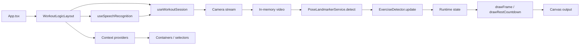

# Архитектура приложения

Документ описывает текущую архитектуру `workout-counter-react`: основные модули, поток данных и жизненный цикл сессии.

## Назначение

Приложение считает повторения упражнений по веб-камере с помощью MediaPipe Pose, рисует состояние в `canvas`, поддерживает голосовые команды и таймер отдыха.

## Слои и зоны ответственности

- `src/App.tsx`
  - Корень UI: оборачивает разметку в `WorkoutLogicLayout`, внутри — `AppLayout` со слотами; в слоты передаются контейнеры из `src/containers`. Без хуков сессии и голоса.

- `src/logic/*`
  - Оркестрация экрана тренировки: `WorkoutLogicLayout` (состояние упражнения/отдыха, `useWorkoutSession`, `useSpeechRecognition`, провайдеры контекстов). Один публичный модуль — подпапка PascalCase + `src/logic/index.ts`. Соглашения — в [docs/src-layout.md](src-layout.md).

- `src/contexts/*`
  - React-контексты значений сессии (разделение chrome / stage и т.д.): подпапка на контекст, баррель `src/contexts/index.ts`.

- `src/selectors/*`
  - Хуки `use…ContainerSelector` для контейнеров (`useContext` + `useMemo`); подпапка на селектор, баррель `src/selectors/index.ts`; для контейнеров реэкспорт через `src/logic/index.ts`.

- `src/containers/*`
  - Компоненты слотов `AppLayout` без пропсов данных сессии; данные через селекторы. Одна папка на контейнер, баррель `src/containers/index.ts`. Соглашения — в [docs/src-layout.md](src-layout.md).

- `src/components/*`
  - Переиспользуемые UI-блоки (например выбор значения, кнопки панели управления): одна папка на компонент, стили рядом с кодом, импорт из барреля `./components`. Соглашения — в [docs/components.md](components.md).

- `src/hooks/useSpeechRecognition.ts`
  - Web Speech API: запуск распознавания, разбор транскрипта, вызов `start` / `pause` / `reset` / `shutdown`, смена упражнения и длительности отдыха по фразам.

- `src/hooks/useWorkoutSession.ts`
  - Оркестратор тренировки: связывает камеру, `PoseLandmarkerService`, детектор и отрисовку (`drawFrame`, `drawRestCountdown` из `src/utils`).
  - Управляет состоянием сессии: запуск, пауза, возобновление, сброс, остановка камеры.
  - Запускает цикл `requestAnimationFrame`, считает `repDelta`, озвучивает повторы.
  - Запускает и рендерит таймер отдыха после остановки.

- `src/hooks/useCameraStream.ts`
  - Работа с `getUserMedia`: старт/стоп потока и диагностика ошибок камеры.

- `src/services/*`
  - `PoseLandmarkerService`: инициализация MediaPipe Tasks Vision (модель heavy, при сбое — lite на CPU), `detectForVideo`, нормализация landmarks в типы из `src/utils/pose.ts`.

- `src/utils/pose.ts`
  - Типы `PosePoint`, `PoseLandmarks`, `PoseFrame`; константа индексов `POSE_INDEX`; `getPoint`, `calculateAngle` для детекторов; отрисовка кадра `drawFrame` (видео «cover», скелет, HUD).

- `src/utils/canvas.ts`
  - Подгонка размера canvas под DPR, очистка, `computeCoverLayout`, экран отдыха `drawRestCountdown`.

- `src/exercises/*`
  - Детекторы упражнений (`*Detector.ts`) реализуют общий интерфейс; математика по точкам импортируется из `src/utils` (`POSE_INDEX`, `getPoint`, `calculateAngle`).
  - `registry.ts`: динамически находит детекторы, фильтрует `isActive !== false`, убирает дубликаты `id`, сортирует.

- `src/types/*`
  - Общие типы приложения, включая единый тип статусов `EntityStatus`, который используется в модели и камере.

## Поток данных

Ключевой цикл: кадр с камеры -> landmarks -> детектор упражнения -> обновление runtime -> рендер в canvas. Контексты публикуются из `WorkoutLogicLayout`; контейнеры читают срезы через `use…ContainerSelector`.

## Жизненный цикл сессии

- `Старт` (в UI — подпись на общей кнопке, когда сессия не в активном выполнении):
  - если сессия в паузе, происходит возобновление без сброса состояния;
  - иначе запускается камера, инициализируется состояние детектора, runtime обнуляется.
- `Пауза` (в UI — та же кнопка с подписью «Пауза», пока `isRunning`):
  - останавливает основной `requestAnimationFrame` цикл обработки.
- `Сброс`:
  - в UI и голосом доступен только при активном выполнении (`isRunning`);
  - обнуляет счётчик и фазу (состояние детектора пересоздаётся).
- `Стоп`:
  - в UI и голосом доступен только при активном выполнении (`isRunning`);
  - завершает сессию, останавливает камеру и запускает таймер отдыха.

## Голосовое управление в архитектуре

- Слой распознавания инкапсулирован в `useSpeechRecognition`; вызывается из `WorkoutLogicLayout`, который передаёт состояние сессии и коллбеки.
- Команды транслируются в API сессии (`start/pause/reset/shutdown`) и в выбор упражнения / длительности отдыха.
- Для предотвращения ложных многократных срабатываний применяется cooldown по ключу команды.

## Контракты расширения

- Новый детектор должен реализовать `ExerciseDetector`:
  - `id`, `name`, `description`,
  - `createState()`,
  - `update(landmarks, state) -> { nextState, repDelta, phase, metrics, confidence }`.
- Для голосового выбора упражнения поддерживается `voiceAliases`.
- Для временного скрытия упражнения из UI/голоса используйте `isActive: false`.

## Нефункциональные ограничения

- Для камеры требуется `HTTPS` или `localhost`.
- Голосовое управление зависит от поддержки Web Speech API браузером.
- Производительность и стабильность счёта зависят от качества видео и видимости ключевых точек.
