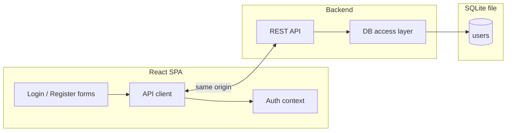

# План: аутентификация по логину и паролю (форма входа, регистрация, API, простая БД)

Связанный чеклист: [auth-login-password-implementation-tasks.md](./auth-login-password-implementation-tasks.md).

## 1. Контекст и цель

- В приложении сейчас нет учётных записей; нужна **минимальная** схема: пользователь регистрируется и входит по **логину и паролю**.
- Данные пользователей хранятся в **простой локальной БД**; фронтенд **не** обращается к БД напрямую — только к **HTTP API** бэкенда.
- Цель эпика: рабочий цикл «регистрация → вход → сохранение сессии на клиенте → выход», с понятным контрактом API и возможностью развить защиту маршрутов позже.

## 2. Границы фичи

**Входит:**

- Небольшой **бэкенд-сервис** (отдельная папка в репозитории, например `server/`) с REST API.
- **SQLite** как самая простая встраиваемая БД (один файл на диске, без отдельного сервера БД).
- Эндпоинты в духе: регистрация, вход, (опционально на первом шаге) «текущий пользователь» по токену/сессии, выход — конкретные пути и тела запросов фиксируются в чеклисте этапа «контракт API».
- **Хеширование паролей** на сервере (например `bcrypt` или встроенные средства выбранного стека), пароли в открытом виде в БД не хранить.
- **Форма входа** и **форма регистрации** на фронтенде (styled-components, соглашения проекта по `components` / при необходимости `logic` / `contexts`).
- **Клиент API** на фронте (fetch или тонкая обёртка): запросы к API идут на **тот же хост и схему**, что и у SPA (например относительные пути `/api/…` или префикс из env, но **без** отдельного «чужого» origin).
- Хранение признака авторизации на клиенте: **JWT в памяти + `httpOnly` cookie** или **только JWT в `httpOnly` cookie** (предпочтительнее для XSS); либо на MVP — JWT в `sessionStorage` с явным компромиссом в документации (выбрать один вариант в задаче по API и зафиксировать в плане реализации).

**По желанию первой итерации (уточнить в реализации):**

- Защита существующих страниц редиректом на `/login` для гостей.
- Письмо подтверждения, восстановление пароля, OAuth — **не** входят.

**Не входит:**

- Продакшен-хостинг и TLS (кроме упоминания в критериях и README).
- Сложные роли и права (достаточно «авторизован / нет»).

## 3. Архитектура (логическая)

### 3.1. Один хост, без CORS

- **CORS на API не настраивается** (нет `Access-Control-Allow-*`, нет отдельной политики cross-origin для этого эпика).
- Для браузера **статика приложения и API — один origin** (одинаковые схема, хост и порт): запросы со страницы к API всегда same-origin.
- **Локальная разработка:** dev-сервер Vite проксирует префикс API (например `/api`) на процесс бэкенда — с точки зрения страницы origin не меняется, CORS не нужен. Альтернатива по смыслу та же: один процесс отдаёт и статику, и API.
- **Продакшен:** один reverse proxy или один Node-процесс: корень — SPA, префикс путей — API; снова один видимый хост для клиента.
- **Локальный Docker:** см. раздел 3.2 — один опубликованный порт наружу, без CORS.



- Таблица `users` (минимум): уникальный `login`, `password_hash`, `created_at`; идентификатор — integer UUID или text по выбору стека.

### 3.2. Локальный Docker (API + SQLite, тот же хост, что и SPA)

Сейчас в репозитории уже есть **статический** образ фронта: multi-stage build → `nginx` отдаёт только `dist` (`Dockerfile`, `docker-compose.yml`, `docker/nginx/default.conf`). После появления API это **нужно доработать**, иначе в контейнере не будет бэкенда, а требование «один origin» запрещает открывать API на отдельном порту хоста для браузера.

**Цель:** по команде вроде `docker compose up` локально поднимается связка, где пользователь открывает **один** URL (один хост:порт), получает SPA и ходит в API по относительным путям (например `/api/…`).

**Рекомендуемая схема (compose):**

- Сервис **`web`** (текущий nginx + собранный фронт): единственный сервис с `ports` на хост (как сейчас `8080:80` или иной порт).
- В **`docker/nginx/default.conf`** добавить `location` для префикса API с **`proxy_pass`** на внутренний адрес сервиса бэкенда (например `http://api:3000`), без выставления CORS-заголовков — для браузера всё остаётся same-origin.
- Отдельный сервис **`api`**: образ на базе Node из каталога `server/` (свой `Dockerfile` или target в общем файле — на этапе реализации), процесс с REST и SQLite.
- **Том (volume)** для файла SQLite, примонтированный к контейнеру `api`, чтобы данные переживали пересоздание контейнера; путь к файлу — через переменную окружения.

**Альтернатива одним образом:** один контейнер Node, который отдаёт статику из `dist` и монтирует маршруты API (без nginx внутри) — допустимо, если проще поддерживать; в плане по compose выше явно видно разделение «статика / API» и типичная доработка существующего nginx.

**Сборка фронта для Docker:** убедиться, что в образ попадает билд с корректным базовым путём для API (относительный `/api/…` или пустой префикс — как зафиксируете в реализации), без захардкоженного `localhost` другого порта.

## 4. Этапы работ

### Этап A. Контракт и каркас бэкенда

- Выбрать стек сервера (например Node + Fastify/Express + драйвер SQLite).
- Описать OpenAPI-черновик или markdown-таблицу методов: метод, путь, тело, ответы ошибок.
- Поднять приложение, миграция/инициализация схемы SQLite при старте или отдельной командой.

### Этап B. Реализация API и БД

- Регистрация: валидация длины логина/пароля, проверка уникальности логина, запись хеша.
- Вход: проверка учётки, выдача session/JWT с разумным временем жизни.
- Middleware проверки авторизации для защищённых маршрутов (хотя бы один тестовый защищённый эндпоинт для проверки).

### Этап C. Фронтенд: UI и состояние

- Маршруты `/login`, `/register` (или один экран с переключением — зафиксировать в реализации).
- Компоненты форм по правилам `src/components` (разметка + `.styled.tsx`).
- Контекст/логика сессии: после успешного входа — сохранение токена/сессии, заголовок `Authorization` или cookie при запросах.
- Отображение ошибок API (неверный пароль, занятый логин, сеть).

### Этап D. Сборка, документация, проверка

- Скрипты `npm`: запуск сервера, (опционально) совместный dev «фронт + API».
- Обновить `README` или `docs/`: как поднять API, где лежит файл БД, переменные окружения.
- Ручная проверка: регистрация двух пользователей, повторная регистрация с тем же логином, вход, выход, неверный пароль.

### Этап E. Локальный Docker

- Спроектировать и добавить в репозиторий **образ и сервис** для API (Node + SQLite), плюс **том** для файла БД.
- **Доработать** существующую раскладку Docker: `docker-compose.yml` (сервис `api`, сеть, том), **`docker/nginx/default.conf`** — проксирование префикса `/api` (или выбранного) на `api`, чтобы с хоста оставался **один** origin.
- Задокументировать команды (`docker compose build/up`), порт публикации, расположение тома с SQLite, отличия от «только статика».
- Ручная проверка в Docker: открыть приложение через опубликованный порт, пройти регистрацию и вход (без отдельного URL API на хосте).

## 5. Критерии готовности

- Регистрация и вход работают через API; в SQLite есть записи только с хешами паролей.
- Формы входа и регистрации доступны из UI и отображают ошибки сервера.
- В репозитории задокументированы команды запуска фронта и бэкенда и то, как SPA обращается к API **на том же хосте** (префикс путей, прокси в dev).
- **Локальный Docker:** `docker compose` поднимает SPA и API так, что с точки зрения браузера один origin; файл SQLite на именованном или bind-томе; инструкция в `README` / `docs/`.

## 6. Риски

- **Куки и same-origin:** при `Set-Cookie` с `httpOnly` убедиться, что путь и при необходимости `SameSite` соответствуют одному хосту со SPA (отдельный cross-origin для API не допускается по этому плану).
- **Прокси nginx → API:** согласовать префикс пути (`/api` с `proxy_pass` с/без обрезки префикса) с тем, как маршруты объявлены в Node, чтобы не получить 404 на все запросы.
- **Права и путь к SQLite в контейнере:** том должен быть доступен процессу в `api`; на Windows с bind-mount возможны нюансы прав — при сбоях зафиксировать в доке рабочий вариант (именованный том vs папка проекта).
- **Безопасность MVP:** ограничить длину полей, базовый rate limit на `/login` и `/register` (по возможности), не логировать пароли.

---

## 7. GitHub: Milestone и подзадачи (Issues)

Используйте один milestone на эпик; issues — порядок выполнения примерно сверху вниз.

### Milestone

| Поле | Значение |
|------|----------|
| **Title** | `Фича: аутентификация (логин/пароль, API, SQLite)` |
| **Description** | Минимальная регистрация и вход; REST API и SQLite; формы на React; локальный Docker (compose, один порт, прокси nginx). План: `specs/features/_archive/auth-login-password/auth-login-password-plan.md`, чеклист `auth-login-password-implementation-tasks.md`. |

### Подзадачи (Issues)

1. **`[План] Аутентификация: эпик и критерии`**  
   Тело: краткая сводка цели; ссылки на `specs/features/_archive/auth-login-password/`; критерии готовности из раздела 5 плана; напоминание про ветку `feature/auth-login-password`.

2. **`[API] Контракт REST, SQLite-схема, каркас сервера`**  
   Тело: эндпоинты регистрации/входа/профиля (черновик); таблица пользователей; выбор стека (Node + SQLite); инициализация БД; выдача API с того же хоста, что и SPA (прокси Vite в dev или единый сервер); **без** настройки CORS.

3. **`[API] Реализация регистрации, входа, хеширование паролей`**  
   Тело: валидация, уникальность логина, bcrypt (или аналог), выдача JWT/session; защищённый тестовый маршрут.

4. **`[UI] Формы входа и регистрации + клиент API`**  
   Тело: маршруты, компоненты по `components.mdc`, обработка ошибок, базовый URL API как same-origin (относительные пути или env без чужого origin), интеграция с контекстом сессии.

5. **`[Док] README/docs: запуск фронта и API, переменные окружения`**  
   Тело: пошаговый локальный сценарий; где создаётся файл SQLite; финальная ручная проверка сценариев из плана.

6. **`[Docker] Compose: API + SQLite, доработка nginx, один порт`**  
   Тело: сервис `api`, том для БД, прокси `/api` в `docker/nginx/default.conf`; один опубликованный порт (сервис `web`); проверка регистрации/входа через UI в контейнерах; без CORS.

### Команды GitHub CLI (`gh`)

Подставьте `OWNER`, `REPO` (например из `git remote -v`).

Создать milestone:

```bash
gh api repos/alexeyabretov00-eng/workout-counter-react/milestones -f title="Фича: аутентификация (логин/пароль, API, SQLite)" -f description="Регистрация и вход; REST API и SQLite; React; локальный Docker (compose, один порт). План: specs/features/_archive/auth-login-password/auth-login-password-plan.md"
```

Создать issues с привязкой к milestone (повторить для каждого заголовка из списка выше):

```bash
gh issue create --repo alexeyabretov00-eng/workout-counter-react --title "[План] Аутентификация: эпик и критерии" --body "Сводка и ссылки на specs/features/_archive/auth-login-password/. Критерии готовности — раздел 5 плана. Ветка: feature/auth-login-password." --milestone "Фича: аутентификация (логин/пароль, API, SQLite)"
```

```bash
gh issue create --repo alexeyabretov00-eng/workout-counter-react --title "[API] Контракт REST, SQLite-схема, каркас сервера" --body "Черновик контракта API, схема users, каркас Node+SQLite; API на том же хосте, что SPA (прокси Vite / единый сервер), без CORS." --milestone "Фича: аутентификация (логин/пароль, API, SQLite)"
```

```bash
gh issue create --repo alexeyabretov00-eng/workout-counter-react --title "[API] Реализация регистрации, входа, хеширование паролей" --body "Валидация, bcrypt, JWT/session, тестовый защищённый эндпоинт." --milestone "Фича: аутентификация (логин/пароль, API, SQLite)"
```

```bash
gh issue create --repo alexeyabretov00-eng/workout-counter-react --title "[UI] Формы входа и регистрации + клиент API" --body "Маршруты /login /register, styled-components, клиент API same-origin, контекст сессии, ошибки API." --milestone "Фича: аутентификация (логин/пароль, API, SQLite)"
```

```bash
gh issue create --repo alexeyabretov00-eng/workout-counter-react --title "[Док] README/docs: запуск фронта и API" --body "Локальный сценарий, env, расположение SQLite, чеклист ручной проверки." --milestone "Фича: аутентификация (логин/пароль, API, SQLite)"
```

```bash
gh issue create --repo alexeyabretov00-eng/workout-counter-react --title "[Docker] Compose: API + SQLite, доработка nginx, один порт" --body "Сервис api, volume для SQLite, proxy_pass /api на api; web единственный с портом на хост; проверка UI в Docker; same-origin, без CORS." --milestone "Фича: аутентификация (логин/пароль, API, SQLite)"
```

В PowerShell для длинного тела удобнее `--body-file` (см. `docs/github-planning.md`).
